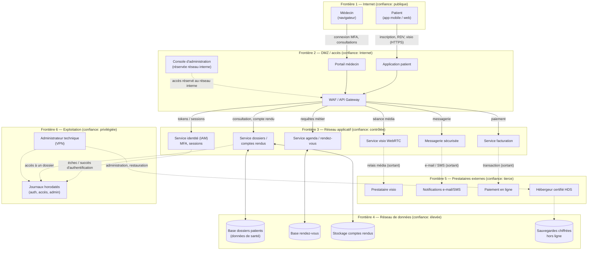

# 01 · Cadrage — Cas d'étude B : Téléconsultation médicale

> Jalon 1 « Cadrer » — livrable : **description d'une page** (architecture et flux),
> qui constitue **l'entrée du système d'agents**.
> Sujet p. 23 : *« Pour chaque cas, rédigez d'abord une description d'une page
> (architecture et flux) : c'est l'entrée de votre système d'agents. »*

---

## 1. Description du système (une page)

### Nom retenu : **MediConsult** — plateforme de téléconsultation (PME de 25 personnes)

**Métier.** MediConsult édite et exploite une plateforme web et mobile permettant à des
patients de **prendre rendez-vous** avec des médecins et de réaliser des **consultations en
visioconférence**. Les médecins utilisent l'outil pour consulter à distance, rédiger une
compte rendu et, le cas échéant, générer une ordonnance. Le secrétariat médical assure
l'accueil, la facturation et le support. La plateforme est hébergée chez un prestataire
certifié **HDS** (hébergement de données de santé).

**Acteurs.**
1. **Patient** — s'inscrit, réserve, consulte, retrouve ses comptes rendus (rôle : externe).
2. **Médecin** — consultations, rédaction, accès aux dossiers des patients qu'il suit (rôle : professionnel de santé).
3. **Secrétariat / support** — accueil, gestion de l'agenda, facturation (rôle : interne).
4. **Administrateur technique** — exploitation de la plateforme, sauvegardes, journaux (rôle : interne, privilégié).
5. **Prestataires externes** — hébergeur HDS, prestataire de visioconférence, fournisseur
   de notifications (e-mail/SMS), fournisseur de paiement.

**Architecture en couches.**
- **Couche d'accès** : application patient (iOS/Android + site web), portail médecin dans un
  navigateur, console d'administration du secrétariat.
- **Couche applicative** : passerelle d'API (API Gateway) devant des services — identité et
  accès (IAM), agenda/rendez-vous, **flux vidéo WebRTC**, messagerie sécurisée patient-médecin,
  gestion des dossiers de consultation, facturation.
- **Couche de données** : base de dossiers patients (données de santé), base des
  rendez-vous, stockage des comptes rendus, **sauvegardes chiffrées**.
- **Couche d'exploitation** : journaux d'authentification et d'accès (horodatés),
  sauvegardes, supervision.

**Flux principaux.**
- Patient ⇄ Internet ⇄ **WAF / API Gateway** ⇄ services applicatifs ⇄ base de données (HTTPS/TLS 1.3).
- Médecin ⇄ portail web ⇄ API ⇄ dossier patient — **accès conditionné à l'authentification forte**.
- Services applicatifs ⇄ **prestataire de visio** (média) et ⇄ notifications e-mail/SMS (sortants).
- Secrétariat ⇄ console d'administration ⇄ API — **depuis le réseau interne uniquement**.
- Administrateur ⇄ infrastructure d'hébergement — **via VPN + accès privilégié contrôlé**.
- Sauvegardes ⇄ stockage hors ligne **chiffré et isolé**.

**Frontières de confiance** (là où l'on cherchera en priorité les menaces).
1. Internet → WAF/API Gateway (public).
2. API Gateway → réseau applicatif (services).
3. Réseau applicatif → réseau de données (base de dossiers).
4. Réseau interne → console d'administration (personnel autorisé).
5. Plateforme → **prestataires externes** (visio, SMS/e-mail, paiement) — *flux sortants, écosystème*.
6. Exploitation → infrastructure (VPN, accès administrateur, sauvegardes).

**Contexte métier et contraintes.**
- **RGPD** : les données de santé sont des *catégories particulières* (art. 9) → protection
  renforcée, **AIPD** obligatoire, **minimisation**, durée de conservation définie,
  notification d'une violation à la **CNIL sous 72 h**, DPO désigné.
- **Secret médical** et déontologie : accès strictement nominatif et justifié (*besoin d'en connaître*).
- **Disponibilité** : une plateforme indisponible empêche des consultations → enjeu de santé publique.
- **Traçabilité** : toute consultation d'un dossier doit être attribuable (**non-répudiation**).
- **Chiffrement** en transit (TLS) et au repos ; hébergement certifié HDS (équivalent français du HDS/HIPAA).
- Aucune donnée patient ne doit sortir vers un service non contractuel.

**Valeur du système.** Continuité de l'activité de soin, confidentialité des dossiers
patients, disponibilité de l'agenda et de la visio, réputation et responsabilité légale de
la plateforme.

---

## 2. DFD — Diagramme de flux de données



### Vue ASCII (pour le dossier imprimé)

```
  PATIENT (mobile/web)        MÉDECIN (navigateur)         SECRÉTARIAT / ADMIN
        │                            │                            │ (réseau interne)
        │        [ Frontière 1 : Internet ]                        │
  ══════╪═════════════════════════════╪════════════════════════════╪═══
        │        [ Frontière 2 : DMZ / accès ]                     │
        ▼                            ▼                             ▼
   App patient                 Portail médecin ──────────── Console d'administration
        └──────────────┬─────────────┴─────────────┬ ─ ─ ─ ─ ─ ─ ┘
                       ▼                           │
                ┌─────────────────┐                │
                │ WAF / API Gateway│◄──────────────┘
                └───────┬─────────┘
        [ Frontière 3 : réseau applicatif ]
    ┌──────────┬────────┼────────┬──────────┬──────────┐
    ▼          ▼        ▼        ▼          ▼          ▼
   IAM       Agenda    Visio   Messagerie  Dossiers  Facturation
 (MFA)      (RDV)     WebRTC   sécurisée   / C.R.      │
    │          │        │        │          │          │
    │     [ Frontière 4 : réseau de données ]          │
    │          ▼        │        ▼          ▼          ▼
    │      Base RDV     │   (messagerie)  Base      Paiement
    │                   │                 patients    (tiers)
    │                   ▼                    │
    │          [ Frontière 5 : prestataires externes ]
    │          Visio tierce   e-mail/SMS   Hébergeur HDS ── Sauvegardes chiffrées
    ▼
  Journaux horodatés ◄─────── [ Frontière 6 : exploitation ]
                                Administrateur technique (VPN)
```

**Lecture** : les attaques à rechercher **en priorité** sont concentrées sur les six
frontières — surtout la passerelle d'accès (1-2), le passage applicatif → base de données (3),
et le **retour des prestataires externes vers la plateforme (5)** : c'est le point où la
confiance est déléguée à un tiers (cf. cours ch. 7, SCRM).

---

## 3. Inventaire préliminaire des actifs (entrée Agent 1)

> Ce tableau est un **point de départ** : l'Agent 1 (Inventaire) doit le
> compléter, le classer et lui attribuer une valeur.

| # | Actif | Type | Criticité CIA dominante | Propriétaire | Remarque |
|---|---|---|---|---|---|
| A-01 | Base de dossiers patients | Donnée (sensible, art. 9 RGPD) | **C** + I | Médecin directeur / DPO | Donnée de santé → enjeu maximal |
| A-02 | Comptes et identités (patients, médecins, admin) | Donnée / service | **C** + A | RSSI / IAM | Vol = usurpation d'identité médicale |
| A-03 | Console d'administration | Application | **C**, I, A | RSSI | Privilèges max → cible prioritaire |
| A-04 | Service de visioconférence | Service | **A** + C | Direction produit | Indispo = consultations annulées |
| A-05 | Agenda / prise de rendez-vous | Application | **A** + I | Direction produit | Cœur du métier |
| A-06 | Messagerie sécurisée patient-médecin | Application | **C** + I | Direction médicale | Flux interpersonnel |
| A-07 | Comptes rendus / ordonnances | Donnée | **I** + C | Direction médicale | Altération = risque pour le patient |
| A-08 | Sauvegardes chiffrées | Donnée | **A** + C | DSI | Seul rempart rançongiciel |
| A-09 | Journaux horodatés (auth, accès) | Donnée | **I** + A | RSSI | Preuve, non-répudiation |
| A-10 | Certificats TLS / clés de chiffrement | Service | **C** + I | RSSI | Compromission = interception |
| A-11 | Prestataires externes (visio, SMS, paiement, HDS) | Tiers | **A** + C | Achats / DSI | **Chaîne d'approvisionnement** |
| A-12 | Site public / app patient | Application | **A** | Direction produit | Surface d'attaque visible |
| A-13 | Personnes (patients, médecins, secrétariat) | Humain | **C** | Direction | Ingénierie sociale, phishing |
| A-14 | Réputation et conformité (RGPD, HDS) | Intangible | — | Direction générale | Sanction jusqu'à 4 % du CA mondial |

---

## 4. Points d'attention pour la suite

- [ ] Valider cette description avec l'enseignant (cas B = bien dans la liste proposée).
- [x] Faire **l'analyse manuelle de référence** sur 5 actifs (A-01, A-02, A-03, A-04, A-08)
      avant de coder les agents — critère d'évaluation « esprit critique » (fait dans `03_...` ;
      l'inventaire complet des 14 actifs ci-dessus couvre aussi les actifs cités par les scénarios
      — correspondance explicite dans `03_...` § Étape 1).
- [ ] Choisir le modèle de menaces : **STRIDE par défaut**
      + **LINDDUN en complément** (forte présence de données personnelles et de santé).
- [ ] Notation : matrice Probabilité × Impact (cohérente avec le sujet) — DREAD/CVSS
      en option pour prioriser les vulnérabilités techniques (CVE).
